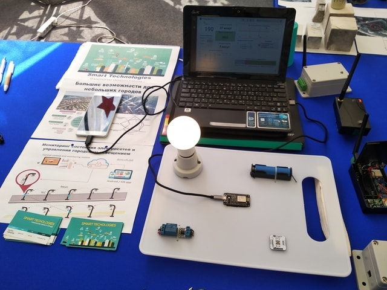

# ivolga18-project
The project has been demonstrated on the [iVolga forum of the young](http://ivolgaforum.ru/).
There is a prototype of the system to monitor city traffic lights and the remote control the IoT devices.

The project includes:
* [docker-services](docker-services/) - a configuration for running server services in Docker.
* [nodemcu](nodemcu/) - a program for ESP-8266 controller that gathers data from sensors and send command from user.
* [adnroid-app](https://github.com/GRomR1/qt-iot-android-app) - a basic implementation to remote control a device by phone on Android.
